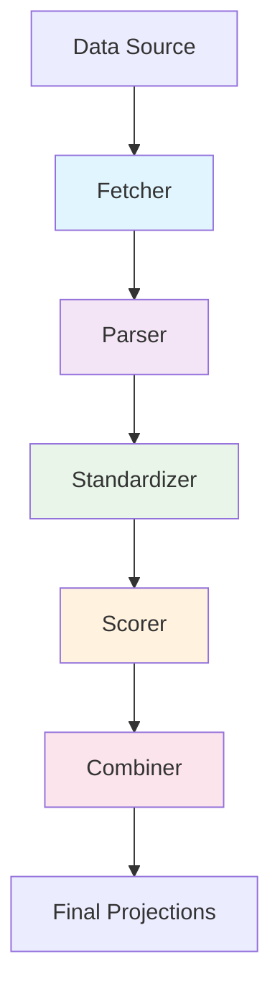

# Architecture Overview

NFLProjections uses a functional architecture with clear separation of concerns. This design makes the system modular, testable, and easy to extend.

## Design Principles

### 1. Separation of Concerns
Each component has a single, well-defined responsibility:
- Fetching doesn't affect parsing or standardization
- Changes to one component don't impact others
- Easy to understand what each component does

### 2. Functional Composition
Components can be combined in different ways:
- Mix and match fetchers, parsers, and standardizers
- Compose complete pipelines from individual components
- Reuse components across different data sources

### 3. Interface-Driven Design
Clear interfaces define component interactions:
- Predictable input/output contracts
- Easy to mock for testing
- Simple to swap implementations

## Architecture Components



### 1. Data Source Fetch
**Purpose**: Retrieve raw data from different sources

- **Web sources**: NFL.com, ESPN, FantasyPros
- **File sources**: CSV, JSON, Excel files
- **API sources**: REST APIs, GraphQL endpoints

**Key Interface**: `fetch_raw_data(**params) -> RawData`

### 2. Data Source Parse
**Purpose**: Convert raw data to structured format

- **HTML parsers**: BeautifulSoup-based table extraction
- **JSON parsers**: API response processing
- **CSV parsers**: File-based data loading

**Key Interface**: `parse_raw_data(raw_data) -> DataFrame`

### 3. Standardization
**Purpose**: Normalize data formats across sources

- **Column mapping**: Different sources use different field names
- **Data cleaning**: Handle missing values, format inconsistencies
- **Player name standardization**: Consistent player identification

**Key Interface**: `standardize(data) -> StandardizedData`

### 4. Scoring
**Purpose**: Apply fantasy scoring rules

- **Standard scoring**: Traditional fantasy points
- **PPR scoring**: Points per reception
- **Custom scoring**: User-defined rules

**Key Interface**: `calculate_points(stats) -> FantasyPoints`

### 5. Combining
**Purpose**: Aggregate projections from multiple sources

- **Average**: Simple mean across sources
- **Weighted average**: Different weights per source
- **Median**: Robust to outliers
- **Custom algorithms**: User-defined combination logic

**Key Interface**: `combine(projections_list, method) -> CombinedProjections`

## Package Structure

```
nflprojections/
├── fetch/           # Data fetching components
│   ├── base_fetcher.py
│   └── nflcom_fetcher.py
├── parse/           # Data parsing components
│   ├── base_parser.py
│   └── nflcom_parser.py
├── standardize/     # Data standardization
│   └── base_standardizer.py
├── scoring/         # Scoring systems
│   ├── scoring.py
│   └── scoring_formats.py
├── combine/         # Projection combination
│   └── projectioncombiner.py
└── sources/         # Complete projection sources
    ├── projectionsource.py
    ├── nflcom.py
    └── nflcom_refactored.py
```

## Usage Patterns

### Pattern 1: High-Level API
For most users, the high-level APIs provide everything needed:

```python
from nflprojections import NFLComProjectionsRefactored

nfl = NFLComProjectionsRefactored(season=2025, week=1)
projections = nfl.fetch_projections()
```

### Pattern 2: Individual Components
For advanced users who need custom pipelines:

```python
from nflprojections.fetch import NFLComFetcher
from nflprojections.parse import NFLComParser
from nflprojections.standardize import ProjectionStandardizer

# Build custom pipeline
fetcher = NFLComFetcher()
parser = NFLComParser()
standardizer = ProjectionStandardizer(custom_mapping)
```

### Pattern 3: Composed Pipeline
Use the ProjectionSource for flexible composition:

```python
from nflprojections import ProjectionSource
from nflprojections.fetch import CustomFetcher
from nflprojections.parse import CustomParser

source = ProjectionSource(
    fetcher=CustomFetcher(),
    parser=CustomParser(),
    standardizer=standardizer
)
```

## Benefits

### Modularity
- Each component has a single responsibility
- Easy to understand and maintain
- Clear boundaries between concerns

### Extensibility
- Add new data sources by implementing Fetcher + Parser
- Add new combination algorithms to ProjectionCombiner
- Add new standardization rules without changing existing code

### Testability
- Each component can be tested independently
- Mock components can be easily substituted
- Pipeline validation at each step

### Reusability
- Fetchers can be reused across different parsers
- Standardizers can be reused across different sources
- Combiners work with any standardized projection data

## Next Steps

- [Functional Architecture Details](functional.md) - Deep dive into implementation
- [API Reference](../api/sources.md) - Explore the full API
- [Examples](../examples/advanced.md) - See advanced usage patterns